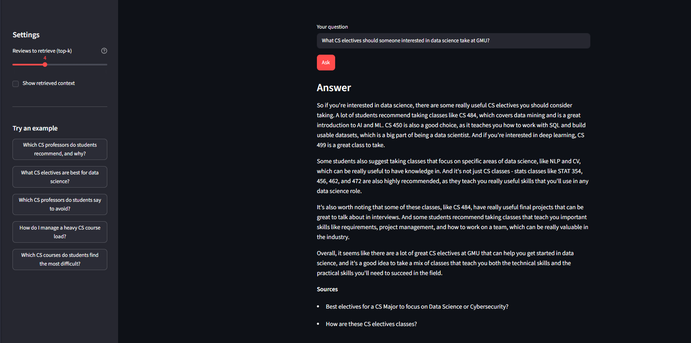
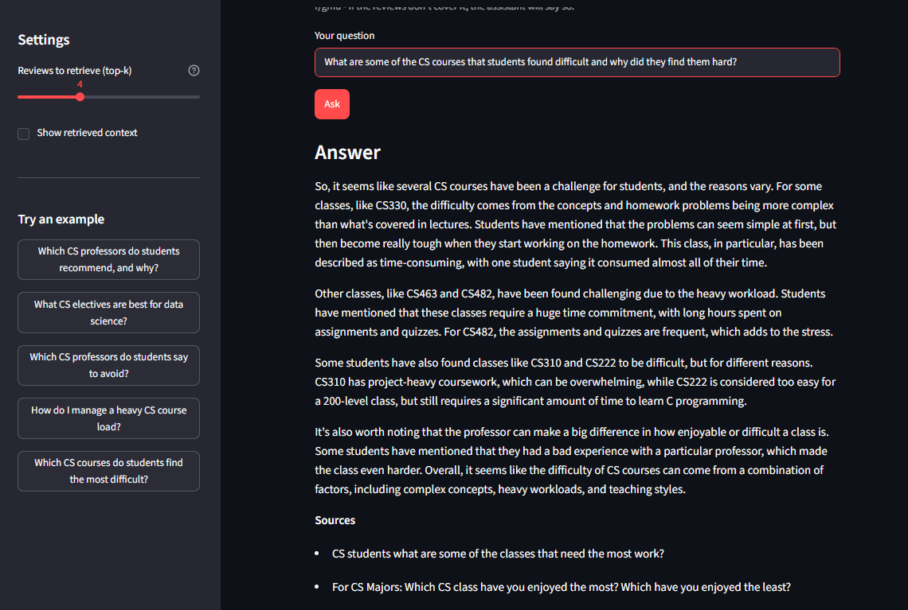
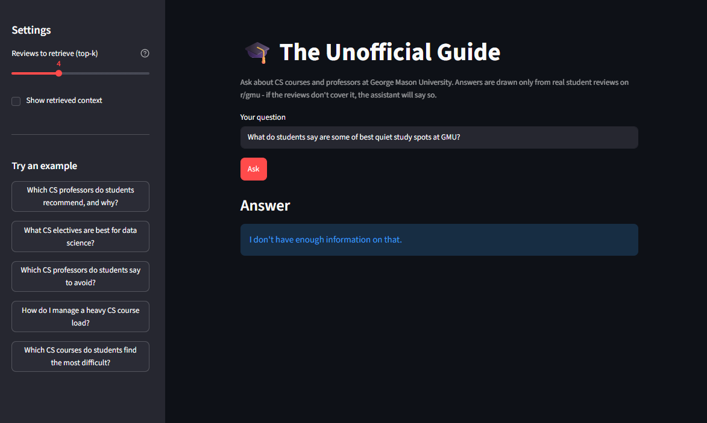

# The Unofficial Guide — Project 1

> **How to use this template:**
> Complete each section *after* you've built and tested the corresponding part of your system.
> Do not write placeholder text — if a section isn't done yet, leave it blank and come back.
> Every section below is required for submission. One-liners will not receive full credit.

---

## Domain

<!-- What topic or category of knowledge does your system cover?
     Why is this knowledge valuable, and why is it hard to find through official channels?
     Example: "Student reviews of CS professors at [university] — useful because official
     course descriptions don't reflect teaching style, exam difficulty, or workload." -->

Domain: CS course and professor reviews at George Mason University. The majority of students make decisions like choosing which course to take and which professor to take based on course difficulty, relevance to their goals, professor's teaching style, grading style, and reputation amongst those who have previously been in their class. Not having this information easily accessible makes registering for classes a stressful process. This kind of experience that only students can provide is hard to find through official university pages, because only course, course descriptions, and professors who are teaching in that particular semester are published. 

---

## Document Sources

<!-- List every source you collected documents from.
     Be specific: include URLs, subreddit names, forum thread titles, or file names.
     Aim for variety — sources that together cover different subtopics or perspectives. -->

| # | Source | Type | URL or file path |
|---|--------|------|-----------------|
| 1 | r/gmu thread |Reddit thread |https://www.reddit.com/r/gmu/comments/1cnjd7v/im_graduating_here_are_some_professors_to_stay/ |
| 2 | r/gmu thread|Reddit thread |https://www.reddit.com/r/gmu/comments/lq2b0x/for_cs_majors_which_cs_class_have_you_enjoyed_the/ |
| 3 | r/gmu thread|Reddit thread |https://www.reddit.com/r/gmu/comments/hrb9ji/cs_majors_cs_450_databases_vs_cs_468_secure/ |
| 4 | r/gmu thread |Reddit thread |https://www.reddit.com/r/gmu/comments/125fkhn/cs_advice/ |
| 5 | r/gmu thread |Reddit thread |https://www.reddit.com/r/gmu/comments/1gzxnfm/cs_310_russell/ |
| 6 | r/gmu thread|Reddit thread |https://www.reddit.com/r/gmu/comments/jiqwa6/easiest_cs_senior_classes/ |
| 7 | r/gmu thread|Reddit thread |https://www.reddit.com/r/gmu/comments/9ve2lx/how_are_these_cs_electives_classes/ |
| 8 | r/gmu thread|Reddit thread |https://www.reddit.com/r/gmu/comments/1twm5k5/cs_can_i_manage_these_courses_togather/ |
| 9 | r/gmu thread|Reddit thread |https://www.reddit.com/r/gmu/comments/150e28r/best_electives_for_a_cs_major_to_focus_on_data/ |
| 10 |r/gmu thread |Reddit thread |https://www.reddit.com/r/gmu/comments/10qyv95/cs_students_what_are_some_of_the_classes_that/ |

---

## Chunking Strategy

<!-- Describe your chunking approach with enough specificity that someone else could reproduce it.
     Include:
     - Chunk size (characters or tokens) and why that size fits your documents
     - Overlap size and why (or why not) you used overlap
     - Any preprocessing you did before chunking (e.g., stripping HTML, removing headers)
     - What your final chunk count was across all documents -->

**Chunk size:** approximately 220 tokens

**Overlap:** around 15% of the overlap

**Why these choices fit your documents:** The chunk size is small enough to keep them focused and reduce noise, but also large enough create meaning. The 15% overlap ensures that content isn't lost if its split across boundaries. Some preprocessing was done before chunking. Each thread was fetched and parsed with BeautifulSoup to remove HTML, decode HTML entities like dashes, ellipses etc., extract the text, remove Reddit boilerpate, and get rid of any whitespace.

**Final chunk count:** 63 chunks across 10 documents

Sample chunks are in chunks.json

---

## Embedding Model

<!-- Name the embedding model you used and explain your choice.
     Then answer: if you were deploying this system for real users and cost wasn't a constraint,
     what tradeoffs would you weigh in choosing a different model?
     Consider: context length limits, multilingual support, accuracy on domain-specific text,
     latency, and local vs. API-hosted. -->

**Model used:** all-MiniLM-L6-v2

**Production tradeoff reflection:** If cost wasn't a constraint and I was deploying this to real users, I would maybe resort to using a model with a larger window, which would allow me to embed whole comments, preventing the risk of dividing content across chunks. In this case, I think an API hosted model adds to latency, which would only be preferable when scaling.

---

## Grounded Generation

<!-- Explain how your system enforces grounding — how does it prevent the LLM from answering
     beyond the retrieved documents?
     Describe both your system prompt (what instruction you gave the model) and any structural
     choices (e.g., how you formatted the context, whether you filtered low-relevance chunks).
     Do not just say "I told it to use the documents" — show the actual instruction or explain
     the mechanism. -->

**System prompt grounding instruction:**

```
You are a knowledgeable George Mason University CS student giving honest, helpful advice to a fellow student, based ONLY on what other students said in the provided review documents.

How to write your answer:
- Sound natural and conversational, like you're sharing your read on things with a friend who asked. Avoid bullet-point data dumps and robotic lists.
- Synthesize across the reviews: connect related points, note where students agree or disagree, and pull out the overall themes instead of restating each comment one by one.
- Explain the reasoning behind what students say (the 'why'), not just the facts.

Grounding rules:
- Use ONLY information found in the provided documents. Never add facts, professor names, course numbers, or claims that are not in them.
- You may rephrase, summarize, and connect ideas that are in the documents, but do not invent new ones or overstate how strongly students feel.
- If the documents don't contain enough information to answer, respond with exactly "I don't have enough information on that." and nothing else.
- Do not mention document numbers or list sources in your answer; the source documents are listed automatically after your answer.
```

Structurally, the retrieved chunks are passed in the user prompt as numbered, source-labeled blocks ([Document N - source: "<thread title>"]), and the model is told to answer using only that context. If retrieval returns no chunks, the system never calls the model.

**How source attribution is surfaced in the response:**

Source attribution is enforced programmatically rather than left to the model. After the model generates its answer, the code collects the source document titles from the retrieved chunks and appends them as a Sources: footer to the end of the response so every grounded answer is accompanied by the exact threads it drew from, guaranteed even if the model itself doesn't cite them. The model is explicitly told not to list sources inline, to avoid duplication. If the context is insufficient, the system returns "I don't have enough information on that." with no sources, since there is no document the answer was drawn from.

---

## Example Responses

Example 1:


Example 2:


Example 3: (out of scope query)



## Query Interface

The system is used through a Streamlit web app (`streamlit run app.py`).

**Input fields:**

- **Your question** (text box) — the natural-language question the user wants answered, e.g. "What CS electives should someone interested in data science take at GMU?"
- **Reviews to retrieve (top-k)** (sidebar slider, 1–10, default 4) — how many review chunks are retrieved and used as context.
- **Show retrieved context** (sidebar checkbox) — when on, displays the retrieved chunks with their source thread, position, and similarity score.
- **Try an example** (sidebar buttons) — one-click prefilled example questions.

**Output fields:**

- **Answer** — the grounded, conversational answer synthesized only from the retrieved student reviews.
- **Sources** — the distinct Reddit threads the answer was drawn from, listed below the answer.
- **Retrieved context** (optional) — the raw chunks used as context, shown only if "Show retrieved context" is checked.

**Sample interaction transcript:**

```
Query: What CS electives should someone interested in data science take at GMU?

Answer:
So, if you're interested in data science, there are some really useful CS electives
you should consider taking. A lot of students agree that CS 310, 450, 483, and 484
are essential classes for data science. CS 484, in particular, is a great introduction
to data mining and AI/ML, which are super relevant in the industry right now. Plus, the
final project in that class is a great talking point for interviews.

Some students also recommend taking CS 499, which covers deep learning, as well as
CS 480, which is a more traditional AI course. These classes will give you a solid
foundation in the algorithms and techniques used in data science. Additionally, having
a good understanding of math is crucial for data science, so taking classes like
MATH 113, 114, 125, 203, and 213 is highly recommended.

It's also worth noting that statistics classes like STAT 354, 456, 462, and 472 are
super useful for data science, as they'll teach you important skills like probabilistic
modeling and optimization theory. Some students even suggest taking classes like
OR 441 and 442, which will give you more depth in these areas. Overall, it seems like
taking a combination of these CS and math classes will give you a really strong
foundation in data science and make you a competitive candidate for jobs in the field.

Sources:
- Best electives for a CS Major to focus on Data Science or Cybersecurity?
- How are these CS electives classes?
```

---

## Retrieval Test Results

Three queries run through the retriever (top-k = 4), showing the chunks returned (by source thread, position, and cosine similarity) and a snippet of each.

### Query 1: "Which CS professors do students recommend taking classes with at GMU?"

| # | Source thread | Position | Similarity | Chunk snippet |
|---|---------------|-----|-----------|---------------|
| 1 | I'm graduating! ...professors to stay away from / take if able | 1 | 0.730 | "Generally, every GMU professor in the CS department is very good... Some standouts here are: Kevin Andrea, the GOAT when it comes to the C programming language... Katherine Russel..." |
| 2 | How are these CS electives classes? | 1 | 0.604 | "CS 325 - Lien... CS 484 - Lin, Jessica... I'm taking CS 484 right now. Lin's lectures aren't that good, but the class is a lot of fun..." |
| 3 | I'm graduating! ...professors to stay away from / take if able | 12 | 0.581 | "...My first professor is Gerald Kowalski. Dunno about the ones to stay away from..." |
| 4 | I'm graduating! ...professors to stay away from / take if able | 24 | 0.573 | "...Being in Shammsedine's 468 class literally helped me... a couple professors who are downright horrible..." |

**Why these chunks are relevant:** The top chunk (similarity 0.73, clearly the strongest) is the exact chunk where a graduating student lists the standout professors they recommend — Kevin Andrea, Katherine Russel, and others — which directly answers "who do students recommend and why." Chunks 3 and 4 come from the same recommendation thread, so they keep the model anchored in the right discussion. Chunk 2, from the electives thread, is weaker (0.60) and only tangentially relevant — it names professors teaching specific electives rather than recommending them — which shows the retriever correctly ranks the on-topic recommendation chunk first while still pulling in professor-mentioning context.

### Query 2: "What CS electives should someone interested in data science take?"

| # | Source thread | Position | Similarity | Chunk snippet |
|---|---------------|-----|-----------|---------------|
| 1 | Best electives for a CS Major to focus on Data Science or Cybersecurity? | 1 | 0.761 | "...Required CS courses... CS 310, 330, 483; MATH 113, 114, 125, 203 (exceptionally important for data science), 213..." |
| 2 | Best electives for a CS Major to focus on Data Science or Cybersecurity? | 3 | 0.749 | "...anyone interested in being a data scientist should take CS 310, 450, 483, 484, 499 (Deep Learning) and STAT 354, 456, 462..." |
| 3 | Best electives for a CS Major to focus on Data Science or Cybersecurity? | 2 | 0.689 | "...CS 478 & CS 482. NLP and CV are domains to which data science is often applied... STAT 354. Definitely take this class..." |
| 4 | How are these CS electives classes? | 1 | 0.623 | "CS 325 - Lien... CS 484 - Lin, Jessica... I'm taking CS 484 right now..." |

**Why these chunks are relevant:** The top three chunks (all ~0.69–0.76 similarity) come from the dedicated "Best electives for... Data Science" thread and name the exact courses a data-science student should take (CS 310, 450, 483, 484, 499, plus the relevant MATH and STAT classes). These are highly specific, on-topic recommendations, which is why they score well above the fourth chunk. Chunk 4, from the general electives thread, still mentions CS 484 (a data-science-relevant course) so it adds supporting context, but its lower score (0.62) correctly reflects that it's a generic elective discussion rather than a data-science-focused one.

### Query 3: "Which CS professors do students say to avoid?"

| # | Source thread | Position | Similarity | Chunk snippet |
|---|---------------|-----|-----------|---------------|
| 1 | I'm graduating! ...professors to stay away from / take if able | 1 | 0.620 | "Generally, every GMU professor in the CS department is very good... Some standouts here are: Kevin Andrea..." |
| 2 | I'm graduating! ...professors to stay away from / take if able | 6 | 0.591 | "...I took CS 580 with Brian Hrolenok... he wasn't the best at answering students' questions..." |
| 3 | For CS Majors: Which CS class have you enjoyed the most / least? | 5 | 0.585 | "...The least? The database class... The professor was full of himself. If it wasn't his answer, it was wrong..." |
| 4 | I'm graduating! ...professors to stay away from / take if able | 24 | 0.579 | "...a couple professors who are downright horrible..." |

---

## Evaluation Report

<!-- Run your 5 test questions from planning.md through your system and record the results.
     Be honest — a partially accurate or inaccurate result that you explain well is more
     valuable than a suspiciously perfect result. -->

| # | Question | Expected answer | System response (summarized) | Retrieval quality | Response accuracy |
|---|----------|-----------------|------------------------------|-------------------|-------------------|
| 1 |Which CS professors do students recommend taking classes with at GMU and for what reasons?| Kevin Andrea is great for taking C programming courses with and his exams are very fair. Dr. Ivan Avramovic provides support in office hours, slides are very put together, and the exams are fair. Dr. Mark Snyder is approachable, provides a lot of support. |Students generally view GMU CS professors positively—praising standouts like Kevin Andrea and Dr. Deng Ping, along with Katherine Russel, Qiang Zheng, and Wassim Masri, for making complex topics engaging and taking time to help—with the few negative comments aimed at certain tough classes rather than the professors themselves. |Relevant |Partially accurate |
| 2 |What advice do students give for managing a heavy CS course load at GMU?| Students say to regularly attend lectures, attend office hours if something is not clear, try to think through problems more than once, and skim readings before attending lectures. |Students say a heavy CS course load at GMU is manageable if you're strategic—research and pick professors carefully for workload-heavy classes (e.g., CS 321, 405, 471), prepare thoroughly for project-heavy ones like CS 310 (brushing up on Java and expecting 15–20 hours per project), balance demanding courses like CS 330 against lighter ones like CS 367 and CS 483, and split heavy classes across semesters if needed. |Off target |Inaccurate |
| 3 |What CS electives should someone interested in data science take at GMU?| Students say CS 484 is a good choice for someone interested in data science as it teaches the algorithms and techniques used in data science. CS 499 is also recommended. It is a deep learning course which teaches skills that are very relevant to the industry. |For data science at GMU, students recommend a mix of CS electives—especially CS 484 (data mining/core algorithms) and CS 499 (deep learning), plus CS 310, 450, 483, and AI-focused options like CS 478, 480, and 482—alongside a strong math/stats foundation (MATH 113, 114, 125, 203, 213 and STAT 354, 456, 462, 472) and specialized OR 441/442, with CS 321 noted as a manageable required course teaching useful industry skills. |Relevant |Accurate |
| 4 |What are some of the CS courses that students found difficult and why did they find them hard?| Many students say CS 310 is a hard class because it is a project heavy course which makes it difficult and time consuming. Some also say CS 330 picks up pace very quickly. Homework and quizzes are time consuming and are harder than examples from the class. |Students found CS courses like CS 310 and CS 330 hard due to heavy, time-consuming project work (15–20 hours each) and complex concepts, CS 330 also for tough quizzes despite being open-note, and CS 463 and CS 482 for sheer workload |Relevant |Accurate |
| 5 |Which CS professors do students say to avoid at GMU?| Many students say to avoid taking freshman level classes with Professor Socrates. A lot of students say to avoid Sapna Gambhir because they felt her assignments lacked clarity and caused confusion, including the fact that her lectures weren't engaging and she did not respond to student questions. Some people also say to avoid Gonzales as a lot of students failed his class. |Most students consider GMU CS professors solid with few to strongly avoid, though a handful draw criticism—Socrates (not ideal for freshman courses), Tecuci (for CS 480 Intro to AI), Gambhir (nice but assignments lack clarity and cause confusion). |Relevant |Accurate |

**Retrieval quality:** Relevant / Partially relevant / Off-target  
**Response accuracy:** Accurate / Partially accurate / Inaccurate

---

## Failure Case Analysis

<!-- Identify at least one question where retrieval or generation did not work as expected.
     Write a specific explanation of *why* it failed, tied to a part of the pipeline.

     "The answer was wrong" is not an explanation.

     "The relevant information was split across a chunk boundary, so retrieval returned
     only half the context — the model didn't have enough to answer correctly" is an explanation.

     "The embedding model treated the professor's nickname as out-of-vocabulary and returned
     results from an unrelated review" is an explanation. -->

**Question that failed:** "What advice do students give for managing a heavy CS course load at GMU?"

**What the system returned:** Instead of study habit advice, the answer focused on course-scheduling strategy — picking professors carefully for workload-heavy classes, preparing for CS 310's project load and Java requirement, balancing demanding classes like CS 330 against lighter ones, and splitting heavy classes across semesters. My expected answer was about day-to-day study habits (regularly attending lectures, going to office hours when something is unclear, thinking through problems more than once, and skimming readings before lectures), almost none of which appeared.

**Root cause (tied to a specific pipeline stage):** This is a problem at the retrieval stage, caused by how the query embeds. The phrase "heavy CS course load" is semantically closest to threads about *which courses to take together* and workload balancing (the "can I manage these courses together" thread) rather than threads offering general study-habit advice. So the top-k chunks were dominated by course selection and scheduling discussion, and the chunks containing the study habit advice I expected scored lower and never entered the context. Because generation is strictly grounded in the retrieved chunks, the model could only answer with the scheduling advice it was given.

**What you would change to fix it:** Clarify the query so retrieval targets study strategy rather than course planning like query expansion toward "study habits / how to keep up / staying on top of coursework" instead of just "course load." Increasing top-k would also help, so the context isn't dominated by a single scheduling focused thread and lower-ranked study habit chunks still make it into the context.

---

## Spec Reflection

<!-- Reflect on how planning.md shaped your implementation.
     Answer both questions with at least 2–3 sentences each. -->

**One way the spec helped you during implementation:**

It guided me in each step of the process. It helped me organize my thoughts and truly understand each step of the RAG pipeline much deeply. 

**One way your implementation diverged from the spec, and why:**

Initially in planning.md, I had specificed the chunk size and overlap to be 300 tokens and 10% respectively but, during implementation, I noticed poor retrieval, and more noise. And so, during implementation, I changed the chunk size to be 220 tokens and overlap to be 15%.

---

## AI Usage

<!-- Describe at least 2 specific instances where you used an AI tool during this project.
     For each: what did you give the AI as input, what did it produce, and what did you
     change, override, or direct differently?

     "I used Claude to help me code" is not sufficient.
     "I gave Claude my Chunking Strategy section from planning.md and asked it to implement
     chunk_text(). It returned a function using a fixed character split. I overrode the
     chunk size from 500 to 200 because my documents are short reviews, not long guides." -->

**Instance 1**

- *What I gave the AI:* I gave Claude my chunking strategy from planning.md and asked it to implement chunk_text(). 
- *What it produced:* Code that keeps text in a chunk until it reaches the target chunking size, keeps chunks that are short separate, splits long text at content boundaries, carries over text into the next chunk based on my overlap size.
- *What I changed or overrode:* Initially Claude suggested to set chunk size to 300, but I set it to be 220 because it was adding more noise. I set the overlap size to be 15% from the initial 10% Claude had suggested to prevent loss of content.

**Instance 2**

- *What I gave the AI:* I gave Claude retrieval strategy from planning.md and asked it implement a retrieve function that would return top 4 chunks for a user's query. 
- *What it produced:* A function that returns the top 4 chunks based on distance in the vector database.
- *What I changed or overrode:* I chose to prepend each chunk's thread title when it's embedded for context, rather than storing the title into the chunk text. This way the embedding model sees which thread/professor a chunk is about (improving retrieval for deep comments that don't name the professor), without permanently duplicating the title inside every chunk.
