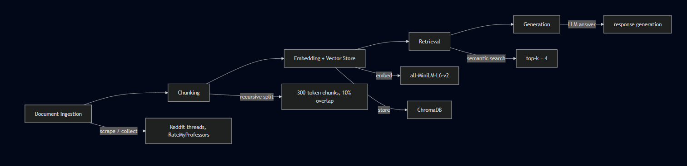

# Project 1 Planning: The Unofficial Guide

> Write this document before you write any pipeline code.
> Your spec and architecture diagram are what you'll use to direct AI tools (Claude, Copilot, etc.) to generate your implementation — the more specific they are, the more useful the generated code will be.
> Update the Retrieval Approach and Chunking Strategy sections if you change your approach during implementation.
> Update this file before starting any stretch features.

---

## Domain

<!-- What domain did you choose? Why is this knowledge valuable and hard to find through official channels? -->

Domain: CS course and professor reviews at George Mason University. 
The majority of students make decisions like choosing which course to take and which professor to take based on course difficulty, relevance to their goals, professor's teaching style, grading style, and reputation amongst those who have previously been in their class. Not having this information easily accessible makes registering for classes a stressful process. This kind of experience that only students can provide is hard to find through official university pages, because only course, course descriptions, and professors who are teaching in that particular semester are published. 
---

## Documents

<!-- List your specific sources: URLs, subreddit names, forum threads, or file descriptions.
     Aim for at least 10 sources that together cover different subtopics or perspectives within your domain. -->

| # | Source | Description | URL or location |
|---|--------|-------------|-----------------|
| 1 | r/gmu thread |Recommended CS professors and CS professors to avoid |https://www.reddit.com/r/gmu/comments/1cnjd7v/im_graduating_here_are_some_professors_to_stay/
| 2 | r/gmu thread |CS courses students found most enjoyable and least enjoyable |https://www.reddit.com/r/gmu/comments/lq2b0x/for_cs_majors_which_cs_class_have_you_enjoyed_the/
| 3 | Rate my professor George Mason University |The rate my professor page for George Mason University | https://www.ratemyprofessors.com/school/352
| 4 | r/gmu thread |Advice for approaching difficulty of CS classes| https://www.reddit.com/r/gmu/comments/125fkhn/cs_advice/
| 5 | r/gmu thread |Details about CS 310 (a data structures course) |https://www.reddit.com/r/gmu/comments/1gzxnfm/cs_310_russell/
| 6 | r/gmu thread |Easiest senior CS electives |https://www.reddit.com/r/gmu/comments/jiqwa6/easiest_cs_senior_classes/
| 7 | r/gmu thread |Advice about specific CS related electives |https://www.reddit.com/r/gmu/comments/9ve2lx/how_are_these_cs_electives_classes/
| 8 | r/gmu thread |Advice about managing CS course load |https://www.reddit.com/r/gmu/comments/1twm5k5/cs_can_i_manage_these_courses_togather/
| 9 | r/gmu thread |Information about best CS electives to choose for data science and cybersecurity |https://www.reddit.com/r/gmu/comments/150e28r/best_electives_for_a_cs_major_to_focus_on_data/
| 10 | r/gmu thread |CS courses that have the most work load |https://www.reddit.com/r/gmu/comments/10qyv95/cs_students_what_are_some_of_the_classes_that/

---

## Chunking Strategy

<!-- How will you split documents into chunks?
     State your chunk size (in tokens or characters), overlap size, and explain why those
     numbers fit the structure of your documents.
     A review-heavy corpus warrants different chunking than a long FAQ. -->

**Chunk size:** approximately 300 tokens

**Overlap:** around 10% of the overlap

**Reasoning:** The chunk size is enough for the model to target a specific section of the reviews but also retain meaning. The overlap size mitigates the issue of loss of meaning across chunks. 

---

## Retrieval Approach

<!-- Which embedding model are you using (e.g., all-MiniLM-L6-v2 via sentence-transformers)?
     How many chunks will you retrieve per query (top-k)?
     If you were deploying this for real users and cost wasn't a constraint, what tradeoffs
     would you weigh in choosing a different embedding model — context length, multilingual
     support, accuracy on domain-specific text, latency? -->

**Embedding model:** all-MiniLM-L6-v2

**Top-k:** k = 4

**Production tradeoff reflection:** If cost wasn't a constraint, I would choose an embedding model that's faster, and which can handle longer chunks of text, while preserving semantic matching. However, a stronger model can provide more relevant and accurate answer, at the cost of poor response time.

---

## Evaluation Plan

<!-- List your 5 test questions with their expected correct answers.
     Questions should be specific enough that you can judge whether the system's response
     is right or wrong. "What are good dining halls?" is too vague.
     "What do students say about wait times at [dining hall name] during lunch?" is testable. -->

| # | Question | Expected answer |
|---|----------|-----------------|
| 1 |Which CS professors do students recommend taking classes with at GMU and for what reasons?| Kevin Andrea is great for taking C programming courses with and his exams are very fair. Dr. Ivan Avramovic provides support in office hours, slides are very put together, and the exams are fair. Dr. Mark Snyder is approachable, provides a lot of support. |
| 2 |What advice do students give for managing a heavy CS course load at GMU?|Students say to regularly attend lectures, attend office hours if something is not clear, try to think through problems more than once, and skim readings before attending lectures. |
| 3 |What CS electives should someone interested in data science take at GMU?|Students say CS 484 is a good choice for someone interested in data science as it teaches the algorithms and techniques used in data science. CS 499 is also recommended. It is a deep learning course which teaches skills that are very relevant to the industry.|
| 4 |What are some of the CS courses that students found difficult and why did they find them hard?|Many students say CS 310 is a hard class because it is a project heavy course which makes it difficult and time consuming. Some also say CS 330 picks up pace very quickly. Homework and quizzes are time consuming and are harder than examples from the class.|
| 5 |Which CS professors do students say to avoid at GMU?|A lot of students say to avoid Sapna Gambhir because they felt her assignments lacked clarity and caused confusion, including the fact that her lectures weren't engaging and she did not respond to student questions. Some people also say to avoid Gonzales as a lot of students failed his class.|

---

## Anticipated Challenges

<!-- What could go wrong? Name at least two specific risks with reasoning.
     Consider: noisy or inconsistent documents, missing source attribution, off-topic
     retrieval, chunks that split key information across boundaries. -->

1. If a chunk has a lot of noise, the model may return chunks that are not entirely relevant to what the user is asking.

2. If a user's opinion is split across chunks, the meaning might be lost or be incomplete, causing the LLM to provide an answer that may not have the information the user is looking for. 

---

## Architecture

<!-- Draw a diagram of your pipeline showing the five stages:
     Document Ingestion → Chunking → Embedding + Vector Store → Retrieval → Generation
     Label each stage with the tool or library you're using.
     You can use ASCII art, a Mermaid diagram, or embed a sketch as an image.
     You'll use this diagram as context when prompting AI tools to implement each stage. -->

---

## AI Tool Plan

<!-- For each part of the pipeline below, describe:
     - Which AI tool you plan to use (Claude, Copilot, ChatGPT, etc.)
     - What you'll give it as input (which sections of this planning.md, which requirements)
     - What you expect it to produce
     - How you'll verify the output matches your spec

     "I'll use AI to help me code" is not a plan.
     "I'll give Claude my Chunking Strategy section and ask it to implement chunk_text()
     with my specified chunk size and overlap" is a plan. -->

**Milestone 3 — Ingestion and chunking:** I'll give Claude my chunking strategy instructions of 300 tokens and the overlap size and ask it to implement that part. I expect it to give me a function that reads the text and splits it recursively into chunks. I'll verify it by checking the chunk size and whether overlap exists.

**Milestone 4 — Embedding and retrieval:** I'll provide Claude with the retrieval section, which has the model I'll use and the top k, and ChromaDB as the vector database. I expect it to give me code that embeds each chunk using the embedding model and store them in ChromaDB, after which it should return the top 4 chunks after the semantic search. I'll verify it by running a query to check if the chunks that are returned are relevant.

**Milestone 5 — Generation and interface:** I'll provide Claude with the user query and the retrieved chunks. I expect it to give me a function that takes in the query and the top k chunks and returns a final answer that is grounded in those chunks. I will ask for a prompt template that instructs the model to answer using only the retrieved context. I will verify it by testing sample questions from the evaluation plan and checking that the responses stay relevant and supported by the retrieved chunks.

